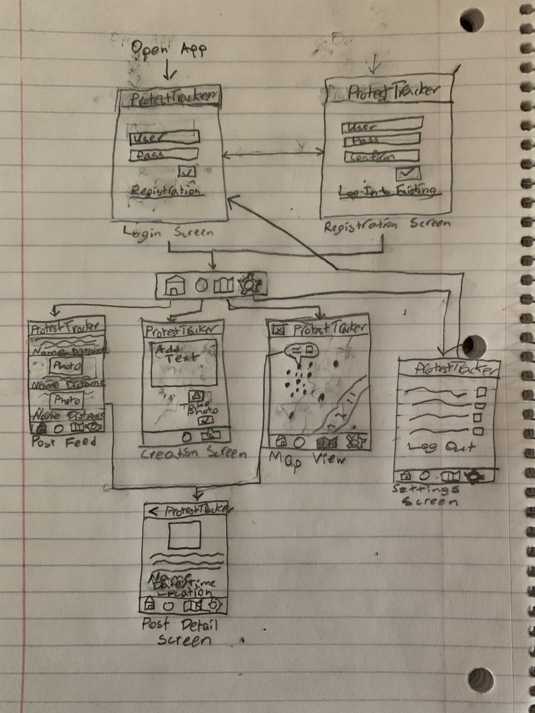

# Protest Tracker

## Table of Contents
1. [Overview](#Overview)
1. [Product Spec](#Product-Spec)
1. [Wireframes](#Wireframes)
2. [Schema](#Schema)

## Overview
### Description
Android app which allows users to stay informed about local protests and easily join them. Protesters can post information about locations and breakouts of looting or brutality with accompanying photo or videos. Other users can access their local information to easily join protests and avoid hotspots of violence.

### App Evaluation
[Evaluation of your app across the following attributes]
- **Category:** Social Networking
- **Mobile:** Mobile is essential to allow users to continue posting and receiving information actively while protesting or traveling to a protest. The app can also provide video and audio recording options to catch unexpected events.
- **Story:** Allows existing protesters to stay informed and avoid danger and trouble while making it easier for new users to begin demonstrating for the things they care about.
- **Market:** Any person who attends protests, is interested in attending a protest you hasn't before, or wants to view information about protesting locally or globally.
- **Habit:** Protesters will use this app consistently before and during a protest to find and post new information.
- **Scope:** V1 would allow text and photo posts with geographical integration. V2 would make posts naturally disapear as they become outdated (with users voting to extend or shorten the time). V3 would add integration with user profiles and history. V4 would allow video and audio to be added into posts.

## Product Spec

### 1. User Stories (Required and Optional)

**Required Must-have Stories**

* Users can view all local posts about protests in their home view
* Users can sign into accounts to post information about protests
* Users can register for new accounts and sign out of their current accounts
* Users can make text posts giving information about current protests
    * Posts can contain images sourced from the camera roll or taken immediately from the camera 
    * Posts are tied to the geographical location where they were made
* Users can go to a map view to see geographical information about local and global protesting
* Users can long hold posts to ignore them and mark them as incorrect/unhelpful
   * Apps which are ignored slide off the screen
* App utilizes a third party library for visual polish

**Optional Nice-to-have Stories**

* Users can click on posts to view additional detail
* Post feed contains infinite scrolling
* Posts automatically disapear based on time elapsed
* Users can double tap posts they think are heplful to make them appear to more users and stay up longer
* Ability to connect acounts to social media to make sharing effortless
* Users can enable always-on recording to ensure they catch evidence of any important events
* Users can comment on posts
* Users can become "community leaders" whose posts are prioritized because of a proven history of truthfulness and usefulness
* Users their own profile page with their post history
* Users can view other user's profiles
* Posts can also include audio and/or video

### 2. Screen Archetypes

* Login Screen
   * Users can sign into accounts to post information about protests
* Registration Screen
   * Users can create new accounts while staying on the app
* Post Feed
    * Users can view all local posts about protests sorted by geographic proximity and time
* Creation Screen
    * Users can make text posts giving information about current protests
* Map View
    * Users can go to a map view to see geographical information about local and global protesting
* Settings Screen
   * Users can sign out of their accounts and modify their settings for the app


### 3. Navigation

**Tab Navigation** (Tab to Screen)

* Post Feed
* Map View
* Creation Screen
* Settings Screen

**Flow Navigation** (Screen to Screen)

* Login Screen
   ==> Post Feed, Registration Screen
* Registration Screen
   ==> Post Feed, Login Screen
* Post Feed
    ==> None, but future version likely involves navigation to post detail screen
* Creation Screen
   ==> Post Feed (After you finish posting)
* Map View
   ==> None, but future version likely involves navigation to post detail screen
* Settings Screen
   ==> Login Screen

## Wireframes


## Schema 
### Models
#### User
| Property      | Type     | Description |
   | ------------- | -------- | ------------|
   | objectId      | String   | unique id for the user (default field) |
   | username      | String   | display name chosen by the user at account creation |
   | password      | String   | password chosen by the user at account creation |
   | createdAt     | DateTime | date when post was created (default field) |
   | updatedAt     | DateTime | date when post was last updated (default field) |
#### Post

   | Property      | Type     | Description |
   | ------------- | -------- | ------------|
   | objectId      | String   | unique id for the post (default field) |
   | author        | \*User| pointer to the user who created the post |
   | location      | ParseGeoPoint   | latitude and longitude at which the post was created |
   | text       | String   | text included within post |
   | image         | File     | image [optionally] included within post |
   | likedBy    | Relation(User)  | array with pointers to users who liked the post |
   | ignoredBy    | Relation(User)   | array with pointers to users who have ignored the post |
   | createdAt     | DateTime | date when post was created (default field) |
   | updatedAt     | DateTime | date when post was last updated (default field) |
   
### Networking
* Login Screen
    * (Read/GET) Query to match given credentials to a User
        ```java
        ParseUser.loginInBackground(username, password, new LoginCallback() {
        @Override
            public void done(ParseUser user, ParseException e) {
                // ...
            }
        });
        ```
* Registration Screen
    * (Create/POST) Create a new User
        ```java
        ParseUser newUser = new ParseUser();
        newUser.setUsername(username);
        newUser.setPassword(password);
        newUser.signUpInBackground(new SignUpCallback() {
            @Override
            public void done(ParseException e) {
                // ...
            }
        });
        ```
* Post Feed
    * (Read/GET) Query all posts where location within geographical limit of User's current location
        ```java
        ParseQuery<Post> query = ParseQuery.getQuery(Post.class);
            query.addDescendingOrder(Post.KEY_CREATED_AT);
            query.setLimit(Post.QUERY_LIMIT);
            query.include(Post.KEY_USER);
            query.whereWithinMiles(Post.KEY_LOCATION, currentLocation, Post.MILES_LIMIT);
            query.findInBackground(new FindCallback<Post>() {
                @Override
                public void done(List<Post> posts, ParseException e) {
                    // ...
                }
            });
        ```
    * (Create/POST) Create a new like on a post
        ```java
            post.getRelation(Post.KEY_LIKED_BY).add(currentUser);
            post.saveInBackground(new SaveCallback() {
                @Override
                public void done(ParseException e) {
                   // ...
                }
            });
        ```
    * (Delete) Delete existing like
        ```java
            post.getRelation(Post.KEY_LIKED_BY).remove(currentUser);
            post.saveInBackground(new SaveCallback() {
                @Override
                public void done(ParseException e) {
                   // ...
                }
            });
        ```
    * (Create/POST) Ignore a post
        ```java
            post.getRelation(Post.KEY_IGNORED_BY).add(currentUser);
            post.saveInBackground(new SaveCallback() {
                @Override
                public void done(ParseException e) {
                   // ...
                }
            });
        ```
* Creation Screen
    * (Create/POST) Create a new post
        ```java
            Post post = new Post();
            post.setDescription(description);
            post.setImage(new ParseFile(photoFile));
            post.setUser(currentUser);
            post.setLocation(currentLocation);
            post.saveInBackground(new SaveCallback() {
                @Override
                public void done(ParseException e) {
                   // ...
                }
            });
        ```
* Map View
    * (Read/GET) Query all posts where location within geographical bounding box around area visible in Map View
        ```java
        ParseQuery<Post> query = ParseQuery.getQuery(Post.class);
            query.addDescendingOrder(Post.KEY_CREATED_AT);
            query.setLimit(Post.QUERY_LIMIT);
            query.include(Post.KEY_USER);
            query.whereWithinGeoBox(Post.KEY_LOCATION, southWestLimit, northEastLimit);
            query.findInBackground(new FindCallback<Post>() {
                @Override
                public void done(List<Post> posts, ParseException e) {
                    // ...
                }
            });
        ```
* Settings Screen
    * (Read/GET) Query for User object containing settings
        ```java
        ParseUser currentUser = ParseUser.getCurrentUser();
        ```
